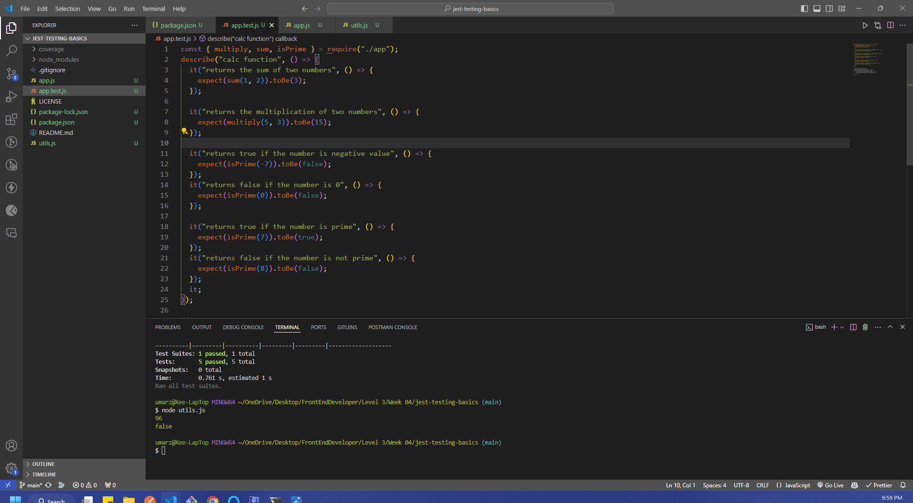
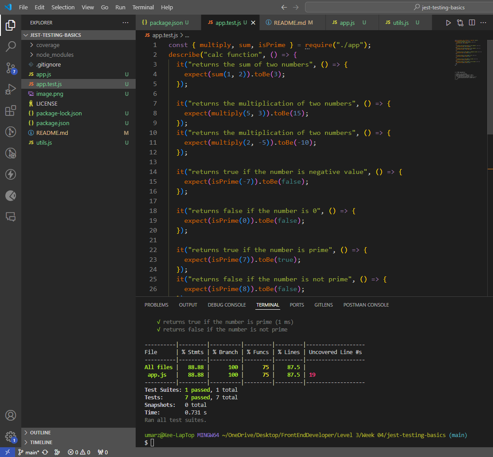
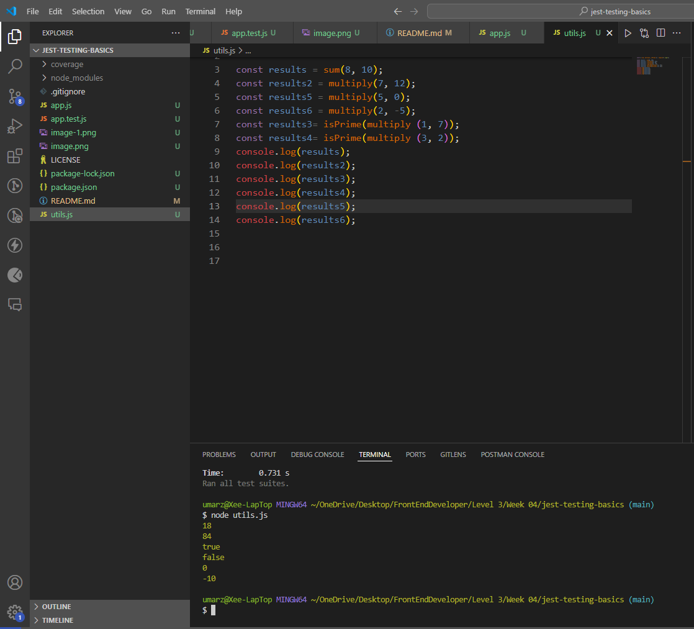

# jest-testing-basics

## Part 1: Created and Cloned GitHub Repository
- Created a New GitHub Repository, jest-testing-basics.
- Initialized it with a .gitignore for Node.js and a README.md. and cloned it.
## Part 2: Setup and Configuration
### Initialize a Node.js Project:

- Within the project directory, run npm init -y to generate a package.json file.

### Installed Jest:

- Added Jest as a development dependency with npm install --save-dev jest.
- In package.json, added a test script to run Jest:
"scripts": {
  "test": "jest"
}
 
## Part 3: Writing Tests
### Utility Functions Implementation:

- Created a file utils.js to implement two functions:
- multiply(a, b): to return the multiplication of a and b.
- isPrime(number):  to check if number is a prime number.
## Testing:

Wrote tests for both functions in utils.test.js, covering expected behavior. For multiply, test normal multiplication, multiplying by zero, and negative numbers. For isPrime, test prime numbers, non-prime numbers, and negative input.

## Run Test:
- Run command npm test to see the results of the code tests. See that test was passed or failed.
- Run node utils.js to see the results of functions with console.log

### Screenshot of the results attached

